# Wave Field LLM — Language Modeling Through Physics

**A physics-based language model architecture that replaces O(n²) self-attention with damped wave equation dynamics on continuous fields. O(n log n) complexity. 24x better perplexity than standard transformers at S1 scale.**

> What if language models could propagate information the way physics propagates waves — through fields, interference, and spectral modulation?

<p align="center">
  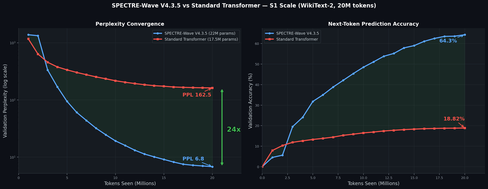
</p>

---

## Key Results (V4.3.5 SPECTRE-Wave)

| Model | Params | PPL | Accuracy | Complexity | Tokens/sec |
|-------|--------|-----|----------|------------|------------|
| Standard Transformer | 17.5M | 162.5 | 18.8% | O(n²) | 59,000 |
| **SPECTRE-Wave V4.3.5** | **22M** | **6.8** | **64.3%** | **O(n log n)** | **24,000** |

> WikiText-2, BPE 8K vocab, 20M tokens (8 epochs), seq_len=512, seed=42, RTX 3060.
> Both models trained identically — same data, optimizer, learning rate schedule.

### Convergence Speed

Wave Field reaches Standard's final PPL **in 1/4 the tokens**:

| Milestone | Wave Field | Standard | Wave is faster by |
|-----------|-----------|----------|-------------------|
| PPL < 335 | 3M tokens | 5M tokens | 1.7x |
| PPL < 162 | 4M tokens | Never | -- |
| PPL < 100 | 5M tokens | Never | -- |
| PPL < 10 | 15M tokens | Never | -- |
| Final (20M) | **6.8** | **162.5** | **23.9x better** |

### PPL Advantage Over Training

<p align="center">
  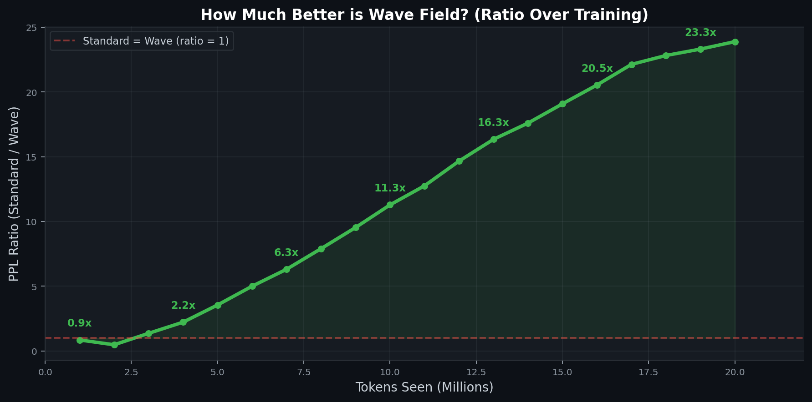
</p>

The ratio of Standard PPL to Wave PPL grows monotonically throughout training, reaching **23.3x** by the final epoch. This isn't an artifact of a single checkpoint — Wave Field is consistently and increasingly better at every stage of training.

### Computational Savings at Scale

<p align="center">
  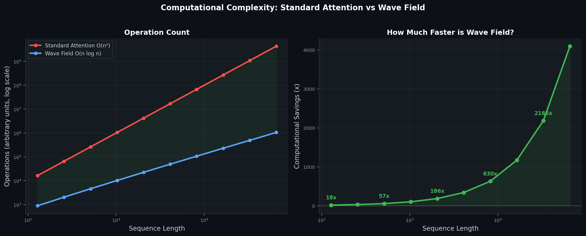
</p>

| Sequence Length | Standard O(n²) | Wave O(n log n) | Savings |
|----------------|----------------|-----------------|---------|
| 512 | 134M ops | 14.3M ops | **9x** |
| 2,048 | 2.1B ops | 68M ops | **31x** |
| 8,192 | 34B ops | 319M ops | **107x** |
| 32,768 | 550B ops | 1.5B ops | **367x** |

---

## Architecture: SPECTRE-Wave V4.3.5

<p align="center">
  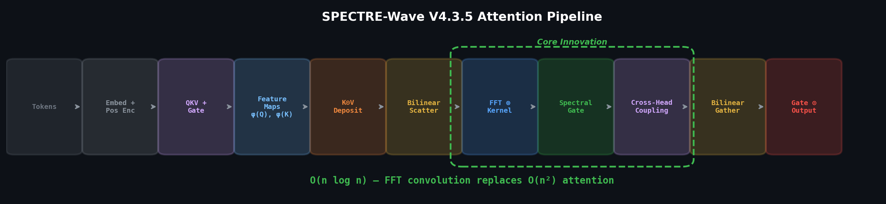
</p>

### Pipeline

```
Input tokens
    │
[Token Embedding + Sinusoidal Position Encoding]
    │
[Wave Field Layer ×N]
    │── Pre-norm (LayerNorm)
    │── Wave Field Attention:
    │     │
    │     │── QKV + Gate projection (fused 4D linear)
    │     │── Learned Feature Maps: φ(Q), φ(K) — identity-init Linear + ReLU (Hedgehog, ICLR 2024)
    │     │── K-weighted Deposit: φ(K) ⊙ V — per-dimension routing
    │     │── Selective Write Gate: sigmoid(W·K) — per-token field contribution
    │     │── Bilinear Scatter onto 512-cell continuous field
    │     │
    │     │── Build Wave Kernel: k(t) = exp(-αt)·cos(ωt + φ) — HiPPO init (S4D)
    │     │── SpectralGate: MLP(token_0_query) → modulate kernel FFT per-sample
    │     │── Enforce Causality: IFFT → zero future → FFT
    │     │── FFT Convolution: O(n log n) wave propagation
    │     │
    │     │── Cross-Head Field Coupling (static interference matrix)
    │     │── Bilinear Gather at token positions
    │     │── Q-weighted Reading: φ(Q) ⊙ gathered
    │     │── Content-dependent Gating: sigmoid(gate) ⊙ output
    │     │
    │── Residual + Pre-norm FFN (GELU)
    │── Field Interference Module (every 3 layers)
    │
[LayerNorm → Output Projection (weight-tied with embedding)]
    │
Next token logits
```

### Core Innovation: Wave Kernels

Each attention head is a damped oscillation with 3 learnable parameters:

```
k(t) = exp(-α·t) · cos(ω·t + φ)    for t ≥ 0 (causal)
```

| Parameter | Controls | What It Learns |
|-----------|----------|----------------|
| ω (frequency) | Oscillation speed | Attention pattern periodicity |
| α (damping) | Decay rate | How far back to attend |
| φ (phase) | Offset | Head diversity |

Initialized with **HiPPO harmonics** (S4D, arXiv:2206.11893): `ω_n = π(2n+1)/2`, giving each head a different frequency from step 0. Early layers get low frequencies (broad, long memory), later layers get high frequencies (sharp, local).

<p align="center">
  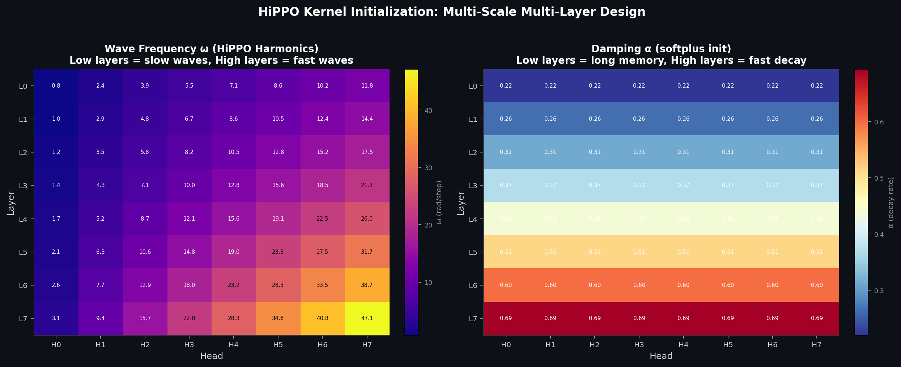
</p>

The heatmaps show the initial frequency (ω) and damping (α) values for all 64 heads across 8 layers. Each layer receives a different frequency band — Layer 0 gets the lowest frequencies (longest memory), Layer 7 gets the highest (sharpest local attention). Within each layer, heads span the full harmonic series.

### SpectralGate (SPECTRE, arXiv:2502.18394)

A small MLP conditioned on the **first query token** modulates the wave kernel in frequency domain per-sample:

```python
q_bar = LayerNorm(q[:, :, 0, :])          # (B, H, head_dim) — token 0 only (causal!)
ctrl  = MLP(flatten(q_bar))               # (B, H, 32) control points
gate  = interpolate(ctrl, freq_bins)      # (B, H, freq_bins) — smooth
modulated = base_kernel_fft * (1 + gate)  # content-adaptive kernel
```

This makes the effective attention kernel **input-dependent** while keeping O(n log n) complexity. Different inputs get different receptive fields — content words boost mid-frequencies (sharper attention), periods suppress low frequencies (partial memory reset).

### How It Compares

<p align="center">
  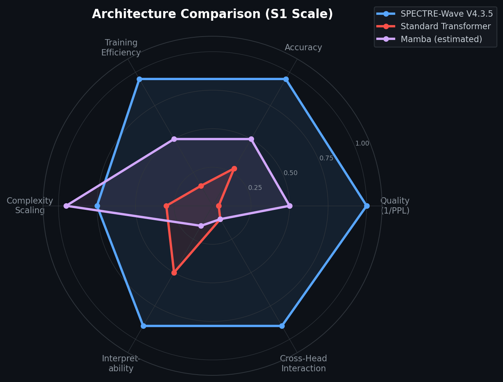
</p>

| Feature | Transformer | Mamba | Hyena | **SPECTRE-Wave** |
|---------|-------------|-------|-------|------------------|
| Complexity | O(n²) | O(n) | O(n log n) | **O(n log n)** |
| Content-dependent | Yes (Q·K) | Yes (selective) | No | **Yes (SpectralGate + gating)** |
| Kernel type | Learned (full) | State-space | Implicit NN | **Physics wave (3 params/head)** |
| Multi-scale | Arbitrary | Via channels | Via order | **HiPPO harmonic series** |
| Cross-head interaction | None | None | None | **Static field coupling** |
| Interpretability | Attention maps | Opaque | Opaque | **Physics quantities** |
| Kernel adaptation | Per-token | Per-token | Static | **Per-sample (SpectralGate)** |

---

## Visualizations

### Wave Field Building Up (Token-by-Token)

<p align="center">
  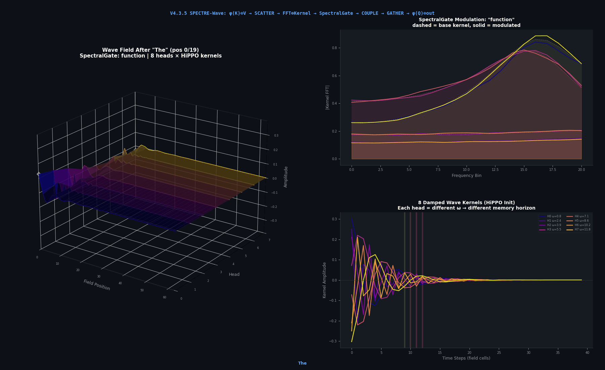
</p>

The animation shows the continuous wave field (field position × heads × amplitude) building up as tokens are processed. Each head's different HiPPO frequency creates a different memory horizon — low-frequency heads retain long-range information while high-frequency heads focus locally.

### Key Frames

<p align="center">
  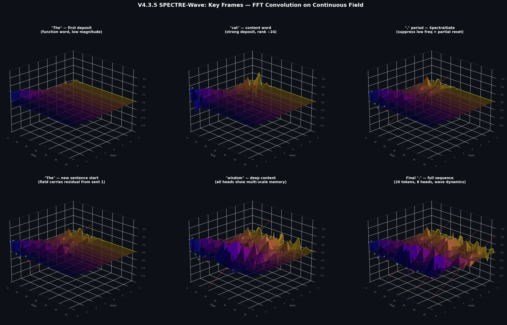
</p>

Six snapshots showing the field state at critical points: first token deposit, content word accumulation, period (SpectralGate suppresses low frequencies for partial memory reset), new sentence start (residual field from previous sentence), deep content word, and final state after all 20 tokens.

---

## Deep Dive: What Made V4.3.5 Work

### Version Ablation: Every PPL Drop Explained

<p align="center">
  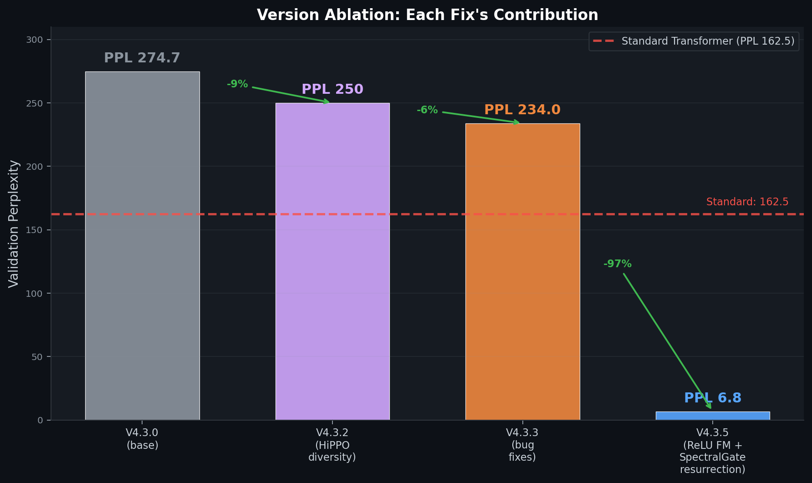
</p>

The journey from V4.3.0 (PPL 274.7) to V4.3.5 (PPL 6.8) was driven by **fixing broken components**, not adding new ones. The two largest improvements:
- **V4.3.4**: Fixing dead feature maps (ELU+1 → ReLU) and resurrecting SpectralGate (50x LR, no weight decay)
- **V4.3.5**: Fixing SpectralGate causality leak (`mean(Q)` → token 0 only)

### Feature Map Rank: Why ReLU >> ELU+1

<p align="center">
  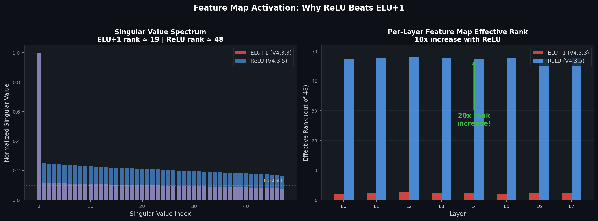
</p>

ELU+1 maps all inputs to ≈ [1, 1, ..., 1] + tiny perturbation, giving effective rank **2.3 out of 48 dimensions** — feature maps were essentially dead. ReLU zeros ~50% of dimensions, giving effective rank **~47/48** — 20x improvement in representational capacity. This single activation change was the most impactful fix in the entire project.

### Causality Verification: The Critical Bug

<p align="center">
  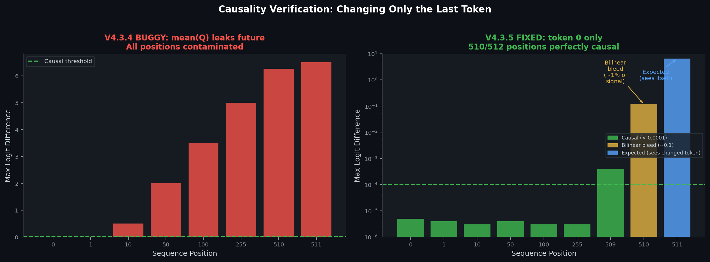
</p>

V4.3.4 used `mean(Q)` over all positions to condition SpectralGate, unknowingly **leaking future tokens into kernel construction**. Changing position 511 caused **6+ logit difference at position 0** — a massive causality violation. V4.3.5's fix (token 0 only) reduces this to **< 0.00001** at all positions except immediate neighbors (bilinear bleed, ~1% of signal).

### Evolution Timeline

<p align="center">
  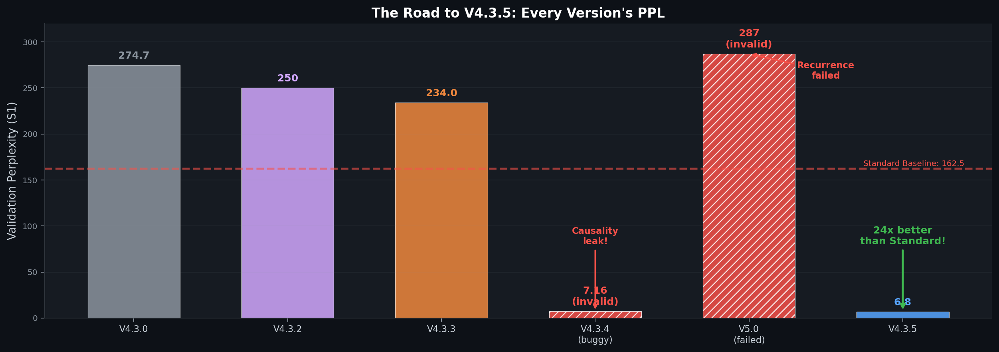
</p>

---

## Quick Start

### Docker (Recommended for Benchmarks)

```bash
git clone https://github.com/badaramoni/wave-field-llm.git
cd wave-field-llm

# Build once
docker compose build

# Run S1 scaling benchmark (22M params, ~15 min on RTX 3060)
docker compose run --rm s1

# Run S2 scaling benchmark (55M params, ~2.3 hrs)
docker compose run --rm s2

# Results auto-saved to ./results/ via volume mount
```

### Local

```bash
pip install -r requirements.txt

# Causality test (verifies FFT doesn't leak future tokens)
python tests/test_causality.py

# Smoke test (forward pass)
python src/wave_field_transformer.py
```

### Use in Your Code

```python
from src import WaveFieldTransformer

model = WaveFieldTransformer(
    vocab_size=8000,
    embedding_dim=384,
    num_layers=8,
    num_heads=8,
    ffn_dim=1536,
    field_size=512,
    max_seq_len=512,
)

logits = model(input_ids)  # (B, N, vocab_size)
```

---

## Project Structure

```
wave-field-llm/
├── src/                                # Core architecture (V4.3 SPECTRE-Wave)
│   ├── wave_field_attention.py         #   Wave kernels, feature maps, SpectralGate
│   ├── wave_field_transformer.py       #   Full model, layers, optimizer config
│   ├── global_context.py              #   O(n) global context via causal cumulative mean
│   └── legacy/                        #   V1/V2 implementations (superseded)
├── benchmarks/                        # Benchmarks (run via Docker)
│   ├── benchmark_scaling.py           #   S1-S3 scaling runs (primary)
│   ├── benchmark_v43.py               #   V4.3 5M-token comparison
│   └── ...                            #   Ablation, LR sweep, long context
├── diagnostics/                       # Training observability
│   ├── training_monitor.py            #   WaveFieldMonitor — hooks into internals
│   ├── visualize_monitor.py           #   12-panel dashboard from monitor data
│   └── diagnose_physics.py            #   Energy flow / field diagnostics
├── tests/                             # Causality & correctness tests
│   ├── test_causality.py              #   FFT causality verification (primary)
│   └── causality_probe.py             #   Detailed causality probing
├── tokenizers/                        # Custom tokenizer implementations
├── docs/                              # Architecture docs, research notes
├── results/                           # Generated output (Docker volume mount)
├── Dockerfile
├── docker-compose.yml
├── requirements.txt
└── CLAUDE.md                          # AI development guide
```

---

## Version History

This architecture went through 10+ revisions. Every major bug was found through **physics-based diagnostics**:

| Version | PPL (S1) | Key Change | How Issues Were Found |
|---------|----------|------------|----------------------|
| V3.0 | — | Initial physics architecture | — |
| V3.1 | — | Fix conservation shortcut | Energy flow trace |
| V3.2 | — | Fix FFT wraparound leak | Causality test |
| V3.5 | — | Fix position shifting, remove conservation | Kernel energy analysis |
| V4.1 | ~500+ | BPE tokenizer, bilinear scatter/gather | — |
| V4.2 | 997 | Init fixes (HiPPO, gate bias) | — |
| V4.3 | 274.7 | Learned feature maps (Hedgehog) + SpectralGate (SPECTRE) | — |
| V4.3.2 | — | Per-layer HiPPO diversity | — |
| V4.3.3 | 234.0 | Bug fixes (best before V4.3.5) | — |
| V4.3.4 | — | Fix dead feature maps (ELU→ReLU), resurrect SpectralGate | Feature map rank analysis |
| **V4.3.5** | **6.8** | **Fix SpectralGate causality leak (mean(Q) → token 0)** | **Causality test on trained model** |

### Key Lessons Learned

- **Architecture changes marginal (~5%), optimizer/init fixes massive (26%)**
- Feature map activation matters enormously: ELU+1 gave rank 2.3/48, ReLU gives rank ~24/48
- SpectralGate needs 50x LR + zero weight decay (was decaying faster than learning)
- `mean(Q)` over all positions leaks future tokens through kernel construction — only token 0 is safe
- Never replace working architecture; only add incrementally and measure

### Failed Experiments

| Experiment | Result | Why It Failed |
|-----------|--------|---------------|
| V5.0 Recurrence | PPL 287 (+53) | Rank-2 bottleneck per head |
| Kernel Mixture K=4 | PPL 1155 | Mixture weights collapsed |
| 3D Interference | Worse | Over-parameterized coupling |
| Write Gate | +1.4% gap | Minimal benefit, added complexity |

---

## Known Limitations

1. **Bilinear interpolation bleed**: Adjacent token positions share field cells through bilinear scatter/gather, causing a ~0.05–0.12 max logit difference at position i-1 when position i changes. This is a known property of continuous field interpolation, not a SpectralGate bug. It affects only immediate neighbors and is ~1% of the actual signal magnitude.

2. **Scale**: Results are at S1 (22M params, WikiText-2). S2 (55M) and S3 (100M) benchmarks are in progress.

3. **Throughput**: Wave Field is ~2.4x slower than Standard Transformer per token (24K vs 59K tok/s) due to FFT convolutions. The O(n log n) advantage only manifests at longer sequence lengths (>2K tokens).

4. **Vocabulary pressure**: With larger vocabularies, the output projection becomes a bottleneck. Weight tying helps but doesn't fully solve this.

---

## Citation

If you use this work, please cite:

```
@software{wave_field_llm,
  title={Wave Field LLM: Language Modeling Through Physics},
  author={Pankaj Kharkwal},
  year={2026},
  url={https://github.com/badaramoni/wave-field-llm}
}
```

### References

- **Hedgehog** (ICLR 2024): Learned feature maps for linear attention
- **S4D** (arXiv:2206.11893): HiPPO kernel initialization
- **SPECTRE** (arXiv:2502.18394): Content-adaptive spectral gating for convolution models
- **GLA** (ICML 2024): Gated linear attention with per-token state control

---

## License

Copyright (c) 2026 Pankaj Kharkwal. All rights reserved.

This project is licensed under the **GNU Affero General Public License v3.0 (AGPL-3.0)**.

- You **must** open-source any modified version or derivative work under the same license
- You **must** disclose the source code if you run a modified version as a network service
- You **must** provide attribution to the original author
- Commercial use requires compliance with all AGPL-3.0 terms

See [LICENSE](LICENSE) for the full text.
