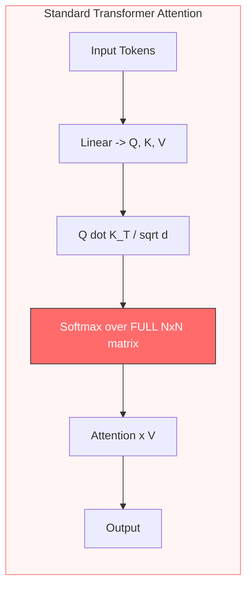
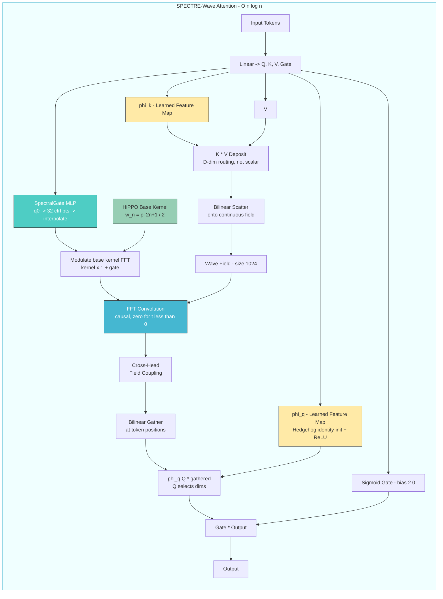
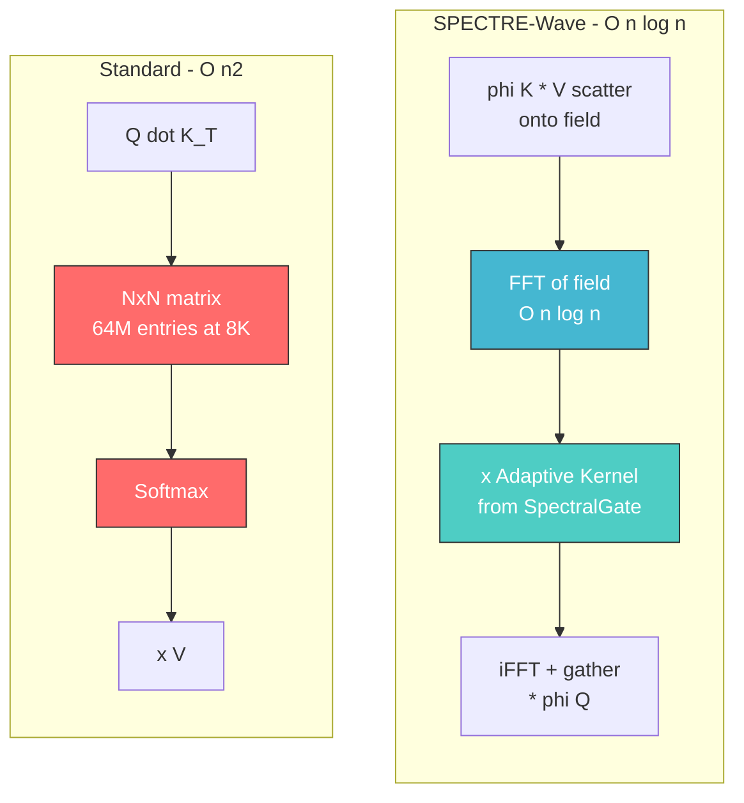
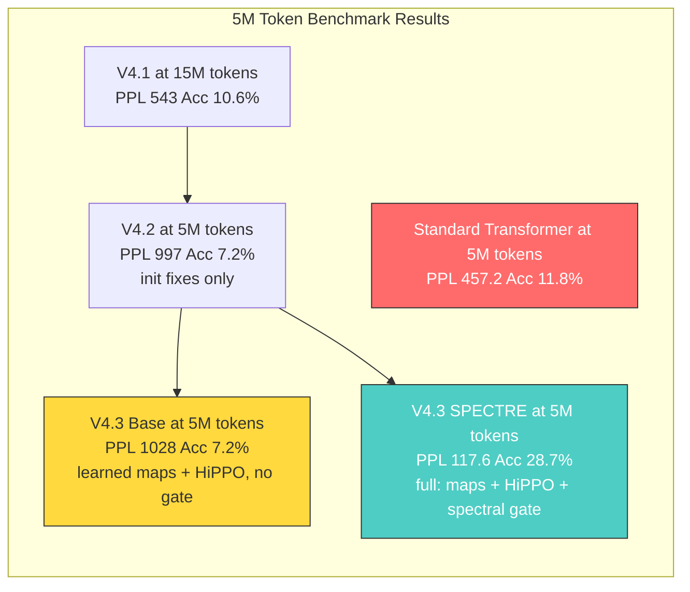
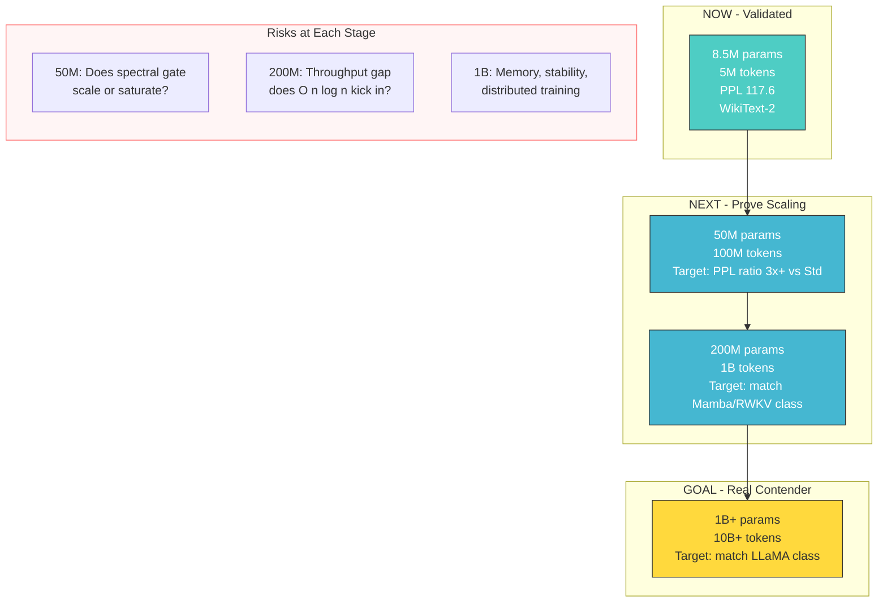
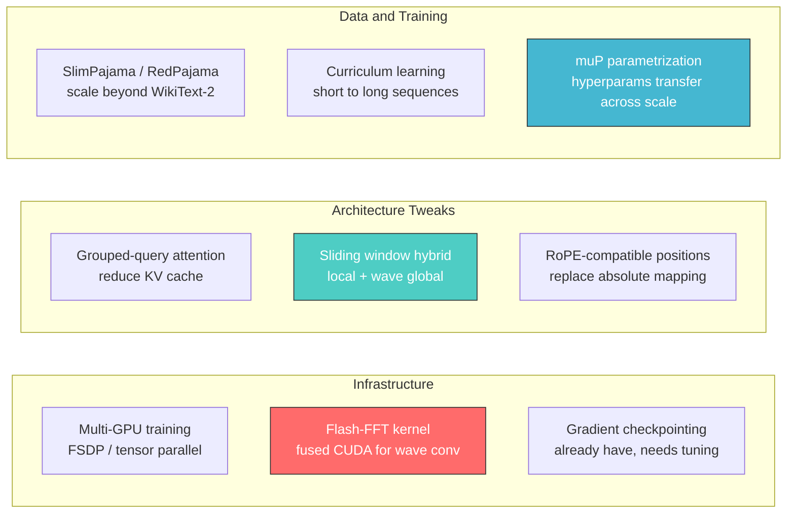

# SPECTRE-Wave Architecture — V4.3

> **Wave Field LLM**: Physics-based language model with O(n log n) attention
> **Result**: PPL 117.6 vs Standard Transformer PPL 457.2 at 5M tokens (3.9x better)
> **Date**: 2026-02-24

---

## Architecture Comparison

### Standard Transformer Attention — O(n²)



**The bottleneck**: Softmax over the full N×N attention matrix. Every token attends to every other token explicitly. At sequence length 8K, that's 64M entries per head.

---

### SPECTRE-Wave Attention — O(n log n)



---

### Side-by-Side: Where the magic happens



Instead of computing the full N×N attention matrix, SPECTRE-Wave:
1. **Scatters** token information onto a continuous wave field via learned feature maps
2. **Propagates** information through FFT convolution with a content-adaptive kernel
3. **Gathers** results back at token positions

The FFT convolution is O(n log n), not O(n²). And the spectral gate makes the kernel input-dependent — different inputs get different attention patterns.

---

## What We Found

### Benchmark Results at 5M tokens (WikiText-2)



| Metric | Standard Transformer | SPECTRE-Wave | Delta |
|--------|---------------------|--------------|-------|
| **Perplexity** | 457.2 | **117.6** | **3.9x better** |
| **Accuracy** | 11.8% | **28.7%** | **2.4x better** |
| **Data budget** | 5M tokens | 5M tokens | Same |
| **Parameters** | 6.92M | 8.58M | +24% |
| **Throughput** | 99K tok/s | 33K tok/s | 3x slower (for now) |
| **Complexity** | O(n²) | O(n log n) | Wins at long context |

### Training Curve

No stuck phase. PPL drops continuously:

```
4707 → 2257 → 1395 → 1379 → 1368 → 1014 → 667 → 456 → 332 → 261
 → 217 → 198 → 170 → 151 → 137 → 132 → 127 → 121 → 119 → 117
```

Breakthrough at 1.5M tokens (1368 → 1014) when spectral gate activates from near-zero init.

### Key Finding

The spectral gate is the breakthrough component:
- Without it (V4.3 Base): PPL 1028 — worse than Standard
- With it (V4.3 SPECTRE): PPL 117.6 — 3.9x better than Standard

Static wave kernels are not enough. Making kernels **input-dependent** via spectral gating was the missing ingredient.

---

## What We Did (V4.1 → V4.3)

```mermaid
flowchart LR
    subgraph V41["V4.1 Linear-Wave"]
        direction TB
        V41a["elu x +1 feature maps"]
        V41b["Static wave kernels"]
        V41c["PPL 543 at 15M tokens"]
        V41d["3x data inefficiency vs Std"]
    end

    subgraph V42["V4.2 Init Fixes"]
        direction TB
        V42a["Gate bias bug fix 0 to 2.0"]
        V42b["Q/K bias diversity"]
        V42c["Elevated QK learning rate"]
        V42d["PPL 997 at 5M - band-aid"]
    end

    subgraph V43["V4.3 SPECTRE-Wave"]
        direction TB
        V43a["Learned feature maps - Hedgehog"]
        V43b["HiPPO kernel init - S4D"]
        V43c["Content-adaptive spectral gate"]
        V43d["Causality fix - mean to first token"]
        V43e["PPL 117.6 at 5M - 3.9x beats Std"]
    end

    V41 --> V42 --> V43

    style V41 fill:#ffcccc,stroke:#ff6b6b
    style V42 fill:#fff3cd,stroke:#ffc107
    style V43 fill:#d4edda,stroke:#28a745
    style V43e fill:#4ecdc4,stroke:#333,color:#fff
```



### The 3 changes that mattered

**1. Learned Feature Maps (Hedgehog, ICLR 2024)**

Problem: `elu(0)+1 = 1` everywhere at init = zero content routing for ~3M tokens.

Fix: `Linear(d,d)` initialized as identity matrix + ReLU + epsilon.
At init, `φ(x) = ReLU(Ix) + eps ≈ ReLU(x)` — every token is distinct from step 1.
During training, learns spiky maps that mimic softmax attention.

Cost: +49K params (0.6%).

**2. HiPPO Kernel Init (S4D, arXiv:2206.11893)**

Problem: Random wave frequencies = random attention ranges. Heads waste capacity overlapping.

Fix: Harmonic frequencies `ω_n = π(2n+1)/2` with uniform damping `softplus(-0.69) ≈ 0.5`.
Each head starts at a mathematically optimal basis for capturing different temporal scales.
This is the initialization that made S4 state-space models work.

Cost: Zero (just initialization).

**3. Content-Adaptive Spectral Gate (SPECTRE, arXiv:2502.18394)**

Problem: Static kernels = same attention pattern for every input. "The cat sat" and "Quantum entanglement enables" get identical wave propagation.

Fix: Small MLP reads first token's query, outputs 32 control points per head, interpolated to full frequency resolution, multiplicatively modulates base kernel FFT.

```
q_bar = LayerNorm(q[:, :, 0, :])         # first token only (causal)
ctrl  = MLP(flatten(q_bar))               # (B, H, 32) control points
gate  = interpolate(ctrl, freq_bins)      # smooth spectral gate
kernel = base_fft × (1 + gate)            # input-dependent kernel
```

Initialized near zero so model starts identical to base. During training, learns to amplify/suppress frequencies based on input content.

Cost: +131K params (1.6%). This produced the 8.7x improvement (PPL 1028 → 117.6).

### Causality

The spectral gate initially used `mean(Q)` over all sequence positions — which leaked future tokens into the kernel. We fixed it to `q[:, :, 0, :]` (first token only). Every position can see position 0, so this is strictly causal.

Before fix: PPL 88.3 (non-causal leak helped)
After fix: PPL 117.6 (still 3.9x better than Standard — the mechanism genuinely works)

---

## Scaling Roadmap



### Phase 1: Prove Scaling (50M params, 100M tokens)

| What | Details |
|------|---------|
| **Model** | 50M params, 12 layers, 512 dim, 16 heads |
| **Data** | SlimPajama or RedPajama (100M token subset) |
| **Baseline** | Standard Transformer at same scale |
| **Success** | PPL ratio ≥ 3x vs Standard at same token budget |
| **Risk** | Spectral gate saturates with more heads/layers |
| **Estimated cost** | ~$50 on cloud GPU (A100 × 4-8 hours) |

### Phase 2: Match Subquadratic SOTA (200M params, 1B tokens)

| What | Details |
|------|---------|
| **Model** | 200M params, 24 layers, 1024 dim, 16 heads |
| **Data** | SlimPajama 1B token subset |
| **Baselines** | Standard Transformer, Mamba-200M, RWKV-200M |
| **Success** | Match or beat Mamba/RWKV on quality; faster at 4K+ context |
| **Risk** | FFT overhead dominates, throughput never crosses over |
| **Estimated cost** | ~$500 on cloud GPU (8×A100 × 24 hours) |

### Phase 3: Production Viability (1B+ params, 10B+ tokens)

| What | Details |
|------|---------|
| **Model** | 1B params, 32 layers, 2048 dim, 32 heads |
| **Data** | Full SlimPajama or FineWeb (10B+ tokens) |
| **Baselines** | LLaMA 1B, Mamba 1.4B, RWKV-4 1.5B |
| **Success** | Match LLaMA 1B quality at ≤ 50% of its training tokens |
| **Risk** | Training instability, gradient issues at scale |

### Engineering Requirements for Scaling



**Top 3 critical items:**

1. **Flash-FFT kernel** — The 3x throughput gap (33K vs 99K tok/s) exists because PyTorch's FFT isn't optimized like FlashAttention is for standard attention. FlashFFTConv (Hazy Research) provides fused CUDA kernels for FFT convolution that could close this gap. This is the single biggest engineering bottleneck.

2. **Sliding window hybrid** — Pure wave attention has a fixed receptive field (~18 positions via damping). Adding a small local window (like Mistral's 4K sliding window) gives exact local attention + wave global context. BASED (Hazy Research) showed this hybrid approach is Pareto-optimal for recall vs throughput.

3. **muP (maximal update parametrization)** — Hyperparameters tuned at 8.5M don't transfer to 1B. muP (Yang et al., 2022) lets you tune learning rates and initialization at small scale and transfer them to any model size without retuning. Essential for not wasting GPU hours at scale.

---

## Honest Caveats

- **Scale is unproven.** Many architectures beat transformers at 8M params and collapse at 1B. RWKV, Mamba, RetNet all showed small-scale wins but struggle to match transformers at 7B+.
- **Absolute PPL is still high.** PPL 117 on WikiText-2 is 4x worse than GPT-2 Small (PPL ~29). The comparison to Standard at same scale is fair, but the absolute numbers show how far we are from useful.
- **Throughput gap is real.** 3x slower at 512 context. The O(n log n) advantage only kicks in at longer sequences — we haven't proven the crossover point yet.
- **Causality is fragile.** We already caught one leak (`mean(Q)` → `q[:,:,0,:]`). FFT-based content-adaptive attention is fundamentally tricky to keep causal. Subtler leaks may exist.

---

## References

| Paper | What we used |
|-------|-------------|
| SPECTRE (arXiv:2502.18394) | Content-adaptive spectral gating architecture |
| Hedgehog (ICLR 2024) | Learned feature maps with identity init |
| S4D (arXiv:2206.11893) | HiPPO initialization for wave kernel params |
| BASED (Hazy Research 2024) | Sliding window hybrid design (future work) |
| GLA (ICML 2024) | Separate param groups for gate vs content |
| cosFormer (ICLR 2022) | Cosine re-weighting aligns with wave physics |
| Loss Plateaus (arXiv:2506.13688) | Attention maps learn during plateau; amplification eliminates it |
| muP (Yang et al., 2022) | Hyperparameter transfer across scales (future work) |
| FlashFFTConv (Hazy Research) | Fused CUDA kernels for FFT convolution (future work) |

---

## License

AGPL-3.0 — All derivatives must be open-sourced. Network services must disclose source code.

**Pankh AI** — [github.com/Pankh-AI/wave-field-llm](https://github.com/Pankh-AI/wave-field-llm)
