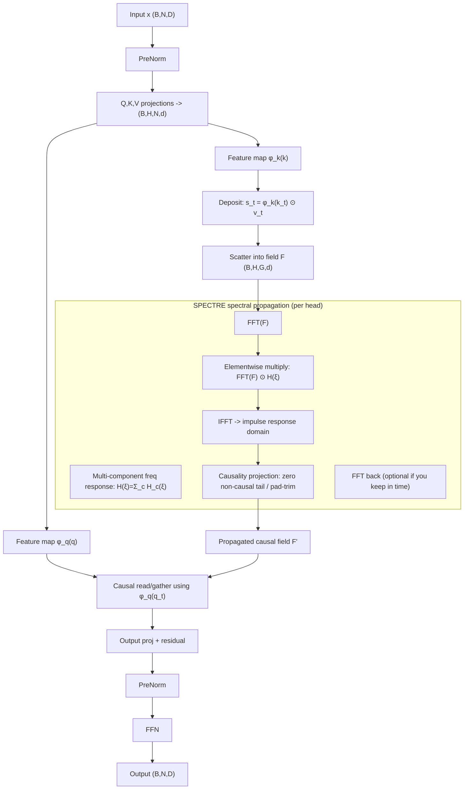
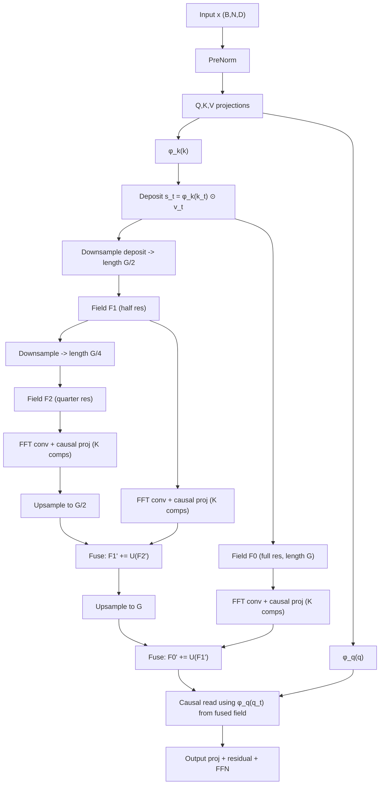

# Making Wave+SPECTRE O(n log n) Attention Competitive with Softmax Transformers

## Executive summary

Wave+SPECTRE (your FFT/field-based attention) is **theoretically sound**: it exploits the fact that **convolution operators (Toeplitz / circulant structure)** can be applied in **O(n log n)** using FFTs, because convolution in time corresponds to elementwise multiplication in frequency. citeturn4search2turn6search4turn3search16turn4search3  
The practical reason it underperforms softmax Transformers at small scale is not “bugs” but a combination of **expressivity constraints** (low effective rank / limited concentration), **content-adaptivity limits** (a mostly stationary kernel struggles with token-specific routing), and **optimisation + numerical issues** (feature-map plateaus, mixed precision FFT pitfalls, and causality leakage unless projected). citeturn0search1turn5search21turn5search8turn5search4turn4search6turn3search16  

The core “pivot” that tends to work in the literature for subquadratic sequence operators is: **keep the fast structured global operator (FFT long conv / SSM)** but add **more expressive basis + controlled input-dependent modulation**, not local/sliding-window softmax (which often destabilises or just dominates the gradients). This is consistent with strong dense-attention-free results from **S4** (structured state space computed via frequency-domain kernels) and **Hyena** (implicit long convolutions plus data-controlled gating) and the explicit critique in **Mamba** that many subquadratic models fail mainly due to weak content-based reasoning unless parameters become input-dependent. citeturn1search12turn1search1turn1search8  

Two recommended architectures, both preserving the FFT hook:

- **Recommendation A (most direct for Wave+SPECTRE):** **Multi-component spectral kernels** (mixture in frequency), with **mandatory causality projection** + **rank/entropy regularisation** to prevent spectral collapse. Complexity remains O(n log n).  
- **Recommendation B (often very effective empirically):** **Multi-resolution fields** (coarse-to-fine FFT fields), which increases receptive-field diversity and reduces oversmoothing (a known issue of pure spectral/global convolutions). citeturn1search1turn1search12turn3search6  

For training, the most reliable PPL improvements in kernelised/linear-attention families typically come from: **separating param groups**, **higher LR on Q/K + feature-map params**, **carefully handling normalisation**, and **forcing FFT in fp32 / stable dtypes** (while the rest stays mixed precision). citeturn0search1turn0search0turn4search1turn4search6  

---

## Why Wave underperforms at small scale

### Softmax attention learns sharp routing early; many subquadratic operators don’t
Softmax attention can form **highly concentrated, token-specific** attention distributions early in training because the softmax normalisation and dot-product geometry naturally allow “winner-take-most” behaviour. Empirically and theoretically, many linear/kernelised attentions struggle with **under-concentrated** attention maps and semantic confusion because different queries can map to similar outputs (non-injectivity and limited selectivity). citeturn5search8turn5search21turn5search4  

This matches what you see: softmax Transformers typically win quickly at 512–2K context and low token budgets.

### Effective-rank and state-capacity bottlenecks show up early
A repeated finding in the literature is that **linear attention outputs often have significantly lower rank** than softmax attention outputs under comparable settings, which correlates with worse loss and slower convergence. citeturn5search4turn5search1  
Also, linear attention can be interpreted as a fixed-size associative memory / fast-weights style mechanism, which creates a capacity bottleneck when sequence-level reasoning needs many distinct “addresses” or high-resolution token interactions. citeturn0search1turn5search17  

Wave+SPECTRE, as a structured global operator, inherits these issues unless you explicitly increase basis richness and content adaptivity (more on that below).

### Constant factors + IO effects matter at small n
Even “asymptotically better” operators can be slower at small n because FFT setup, complex arithmetic, and non-fused memory traffic can dominate. FlashAttention’s core point is that wall-clock speed is often IO-bound, and algorithmic complexity alone isn’t enough—kernels must be designed with memory hierarchy in mind. citeturn1search2turn1search10  
This matters for Wave: at 512–2K, your FFT path can lose; the payoff arrives at larger contexts (8K+), especially when the baseline becomes memory-bound.

---

## Theoretical limits that matter most

### The FFT hook and what it implies
The mathematical hook is: **circulant convolution operators are diagonalised by the DFT**, enabling fast application via FFT; Toeplitz operators are closely related and often handled by padding/embedding tricks. citeturn6search4turn6search13turn3search16  

If you represent the field update as linear convolution, you are effectively applying a structured matrix \(T(h)\) (Toeplitz/circulant family) to a sequence/vector:
\[
y = T(h)\,x
\]
and via FFT:
\[
y \approx \mathrm{IFFT}\left(\mathrm{FFT}(x)\odot \mathrm{FFT}(h)\right)
\]
with padding/clamping to obtain *linear* (not circular) convolution and to preserve causality. citeturn3search16turn6search4turn4search3  

This makes **O(n log n)** possible, but also enforces strong structure: the “kernel” has a global frequency response.

### Effective rank as a useful lens for “expressivity”
A practical way to quantify “how many distinct patterns” your operator can represent is **effective rank**, often defined using singular values \(\sigma_i\):
\[
r_{\mathrm{eff}}(A)=\frac{\left(\sum_i \sigma_i\right)^2}{\sum_i \sigma_i^2}
\]
which measures how many dimensions are “significant”. citeturn5search5  

Two relevant observations from research:

- The attention matrix (or output features) rank correlates with model effectiveness and convergence speed in some studies. citeturn5search1  
- Linear attention variants commonly exhibit a **low-rank dilemma** where learned representations have reduced rank vs softmax attention. citeturn5search4  

For Wave-like spectral operators, there’s an additional frequency perspective:

- A circulant convolution matrix has eigenvalues given by the DFT of its kernel; “rank richness” relates to how broadly the spectrum carries energy rather than collapsing into a few bins. citeturn6search3turn6search4  

### Expressivity limits: universality vs practical selectivity
Transformers with softmax attention have strong expressivity/universality results (under certain assumptions). citeturn5search2turn5search6  
But universality doesn’t guarantee practical learning speed, and many efficient attentions trade away **selectivity and injectivity**, which can show up as poorer retrieval/reasoning and a need for more depth/tokens to compensate. citeturn5search8turn5search21turn0search1  

### Approximation error views: kernelised attention and low-rank approximations
Different efficient attention families sit on different approximation axes:

- **Random features / kernel estimation** (Performer) approximate softmax attention kernels with theoretical guarantees. citeturn0search0turn0search4  
- **Low-rank approximations** (Linformer) assume attention is approximately low-rank and project it. citeturn2search0turn2search4  
- **Nyström methods** (Nyströmformer) approximate the softmax matrix using landmarks. citeturn0search2turn0search10  
- **Structured operators** (S4, Hyena) replace attention with long convolutions + structured dynamics and show competitive results at long context. citeturn1search12turn1search1  

Wave+SPECTRE is closest to the last category: a structured global operator. The lesson from Hyena/Mamba is explicit: *content-dependent modulation* is often the missing piece for language modelling quality. citeturn1search1turn1search8  

### Numerical stability and causality are not optional
FFT convolution is **circular** by default; converting to **linear causal** behaviour requires padding and/or post-projection. citeturn3search16turn6search4  
Mixed precision complicates FFT reliability: half precision FFT libraries have constraints/limitations, and mixed precision policies often keep numerically sensitive ops in fp32. citeturn4search6turn4search1  
For your model, the “causality projection” is not a trick—it is a correctness constraint.

---

## Architectural pivots that preserve O(n log n) while increasing expressivity

Below is a practical pivot table focused on *keeping FFT convolution as the global mechanism*.

### Pivot comparison table

| Pivot | Time complexity per layer | Memory | Expressivity gain (intuition) | Implementation risk | Notes |
|---|---:|---:|---|---|---|
| Multi-component spectral kernels (K components/head) | \(O(n\log n) + O(Kn)\) | \(O(n)\) | Increases spectral degrees of freedom; raises effective rank by widening/diversifying frequency response | Low–Medium | Best “pure Wave” pivot; combine components in frequency without extra FFTs |
| Multi-resolution fields (S scales) | \(\sum_s O(n_s \log n_s)\) | \(\sum_s O(n_s)\) | Adds multi-scale basis; reduces oversmoothing; improves long+short interactions | Medium | Inspired by multi-scale conv/SSM successes; often improves LM stability |
| Blockwise / piecewise-stationary convolution | \(O(n\log B)\) for block size B | \(O(n)\) | Allows local nonstationarity (content changes) while keeping FFT blocks | Medium–High | Needs careful boundary handling and causality across blocks |
| Input-conditioned spectral modulation (global) | \(O(n\log n)\) + conditioning net | \(O(n)\) | Adds content-based reasoning by modulating frequency response with token summaries | Medium | Aligns with “parameters as function of input” insight from Mamba/Hyena citeturn1search8turn1search1 |
| Low-rank softmax residual (global, not sliding window) | \(O(nr)\) + Wave \(O(n\log n)\) | \(O(nr)\) | Restores sharp routing for a small subspace; can close PPL gap | Medium | Use Nyström/landmarks; stable if residual is scaled and r small citeturn0search10turn0search2 |
| Feature-map upgrade (Performer-style or learnable) | \(O(nm)\) + Wave \(O(n\log n)\) | \(O(nm)\) | Better kernel approximation / selectivity; reduces semantic confusion | Medium | Draws from Performer theory; may help more than gates citeturn0search0turn0search4 |
| Gates/regularisation only | ~unchanged | ~unchanged | Mostly stabilises; rarely closes expressivity gap alone | Low | Useful as support (prevent collapse), but not the main pivot (your logs show this) |

Primary inspirations behind these pivots: Performer (kernel approximation), Linformer/Nyströmformer (low-rank/landmarks), S4/Hyena/Mamba (long conv/SSM + gating/conditioning), and FFT/Toeplitz theory. citeturn0search0turn2search0turn0search10turn1search12turn1search1turn1search8turn6search4turn4search3  

### Recommendation A: Multi-component spectral kernels (pure Wave, best first pivot)

**Idea:** Instead of one analytic wave kernel per head, use a **mixture**:
\[
h(t) = \sum_{c=1}^{K} a_c\, e^{-\alpha_c t}\cos(\omega_c t+\phi_c)\quad (t\ge 0)
\]
This increases the model’s ability to represent multiple time-scales and oscillatory patterns (similar spirit to long-conv/SSM kernels that work well). citeturn1search12turn1search1  

**Why it preserves O(n log n):** you still compute
\[
Y(\xi) = X(\xi)\cdot H(\xi),\quad H(\xi)=\sum_c H_c(\xi)
\]
and do **one FFT and one IFFT**; the mixture is computed as extra elementwise ops, not extra FFTs.

**What it fixes:** spectral richness → higher effective rank; reduces oversmoothing; improves capacity to represent multiple dependency types.

**What to watch:** kernels can collapse (all components learn same frequency/decay). Add lightweight diversity regularisers (details below).

### Recommendation B: Multi-resolution fields (second-best pivot, often very strong)

**Idea:** Maintain multiple fields \(F^{(s)}\) at different resolutions (e.g., full, half, quarter). Each scale has its own kernel mixture. You up/downsample between them. This resembles multi-scale signal processing and addresses a known issue of global spectral operators: losing local/high-frequency detail. citeturn3search6turn1search12turn1search1  

**Why it preserves near O(n log n):** if you halve length each scale, total FFT cost is:
\[
n\log n + \frac{n}{2}\log\frac{n}{2} + \frac{n}{4}\log\frac{n}{4} + \dots \approx 2n\log n
\]
So you pay a modest constant factor for much richer basis.

### Blockwise/adaptive convolution: how to do “content adaptivity” without killing FFT

If your kernel is fully token-dependent at every position, you lose convolution structure. But you can keep FFT by conditioning at **coarse granularity**:

- Compute per-block summary \(s_b\) (e.g., mean pooled hidden states)  
- Predict kernel mixture parameters \(\{\alpha,\omega,a\}\) per block  
- Apply FFT convolution within each block with those parameters  

This yields **piecewise-stationary** kernels. Complexity becomes \(O(n \log B)\) where \(B\) is block size; for fixed \(B\), close to \(O(n)\), and still very fast. The trade-off is that cross-block long-range interactions need an additional mechanism (e.g., multi-resolution field to carry global context). The motivation aligns with the “input-dependent parameters enable reasoning” theme highlighted by Mamba and Hyena. citeturn1search8turn1search1  

### Low-rank softmax residual (global), not sliding-window

Since sliding-window softmax was a disaster for you, the safer variant is a **global low-rank residual** that doesn’t compete locally at every token.

Two common options:

- **Nyström residual:** choose \(r\) landmarks; approximate attention via Nyström reconstruction in \(O(nr)\). citeturn0search10turn0search2  
- **Projected softmax residual:** project \(q,k\) to \(r\ll d\) and compute softmax there (still \(O(n^2)\) if done naively; but with landmarks it becomes \(O(nr)\)).

You keep the Wave output as the main path and add the residual with a small coefficient \(\lambda\) and/or schedule \(\lambda\) up over training to prevent early domination.

---

## Optimiser and training-recipe changes that reliably improve PPL/accuracy

This section is written to be directly implementable, and it reflects what consistently helps kernelised/linear attention families in practice.

### Param-group strategy (most important)

Your empirical “QK LR 3×” win is consistent with a known pattern: in kernel/linear attention, the feature-map and Q/K dynamics often need **more aggressive optimisation** to avoid getting stuck in low-selectivity regimes. Linear attention is closely tied to associative-memory updates; if Q/K don’t become discriminative early, the model stays “blurry”. citeturn0search1turn5search21  

Recommended param groups:

- Group A (fast): **Q-proj, K-proj, feature-map MLP, kernel-mixture params**  
- Group B (normal): V-proj, out-proj, FFN weights  
- Group C (no weight decay): norms, biases, any stability scalars, kernel parameters that represent physical constraints  

Concrete PyTorch-style example:

```python
def make_param_groups(model, base_lr, wd):
    no_wd = set()
    fast = set()

    for name, p in model.named_parameters():
        if not p.requires_grad:
            continue
        # No weight decay on norms/bias
        if name.endswith(".bias") or "norm" in name.lower():
            no_wd.add(name)

        # Fast group: q/k + feature map + spectral params
        if any(k in name.lower() for k in [
            "q_proj", "k_proj", "qkv_proj", "phi", "feature_map",
            "kernel", "spectral", "omega", "alpha", "phase"
        ]):
            fast.add(name)

    def params(names):
        for n, p in model.named_parameters():
            if n in names:
                yield p

    return [
        {"params": list(params(fast - no_wd)), "lr": 3.0 * base_lr, "weight_decay": wd},
        {"params": list(params(fast & no_wd)), "lr": 3.0 * base_lr, "weight_decay": 0.0},
        {"params": [p for n, p in model.named_parameters()
                    if p.requires_grad and n not in fast and n not in no_wd],
         "lr": base_lr, "weight_decay": wd},
        {"params": list(params(no_wd - fast)), "lr": base_lr, "weight_decay": 0.0},
    ]
```

Key notes:
- You may also want a **two-phase schedule**: keep Q/K at 3× only for the first 20–30% of training, then decay multiplier → 1× (prevents late instability).  
- Avoid weight decay on kernel parameters representing frequencies/decays; weight decay can distort them.

### Feature-map recipe (high leverage)

Performer shows that better kernel approximations can preserve attention quality while reducing complexity. citeturn0search0turn0search4  
Even if you don’t use random features exactly, the takeaways are:

- Enforce positivity / stabilise denominators carefully (avoid near-zero normalisers)  
- Consider replacing a ReLU-only map with smoother maps (e.g., ELU+1 style used in classic linear attention) or use a learnable map with explicit scale controls. citeturn0search1turn5search14  

Practical stabilisers:
- Add a small \(\epsilon\) floor to any normalisation term
- Normalise \(\phi(k)\) magnitude per head (RMSNorm-like on features) to prevent blow-ups/collapses

### Numerics: fp32 FFT and causality projection are mandatory

FFT-based convolution needs **linear vs circular** correctness: padding makes circular convolution equivalent to linear convolution. citeturn3search16turn6search4  
Also, half-precision FFT has limitations and mixed precision best practices often keep sensitive ops in fp32. citeturn4search6turn4search1  

Practical rule:
- Run FFT/IFFT and kernel generation in fp32 (complex64)  
- Cast back to fp16/bf16 after IFFT  
- Keep the rest in mixed precision using entity["organization","PyTorch","machine learning framework"] AMP. citeturn4search1turn4search6  

### Regularisation that actually targets the failure mode (spectral collapse / low rank)

Instead of generic dropout-only, add small regularisers that directly oppose collapse:

- **Spectral entropy penalty:** encourage \(H(\xi)\) to distribute energy across frequencies rather than a single spike.  
- **Component diversity:** penalise components whose \((\omega,\alpha)\) become too similar:
  \[
  \mathcal{L}_{\text{div}}=\sum_{c<c'}\exp\left(-\frac{(\omega_c-\omega_{c'})^2}{\tau_\omega^2}-\frac{(\alpha_c-\alpha_{c'})^2}{\tau_\alpha^2}\right)
  \]
- **Rank proxy:** maximise variance across heads/components (cheap proxy for increasing effective rank).

These are small, targeted, and align with the “rank matters” empirical findings. citeturn5search4turn5search1  

---

## Practical experiments and ablations to run

This is a minimal-compute plan: it is designed to tell you quickly whether a pivot is worth scaling.

### Metrics to log (non-negotiable)

1. Val PPL and accuracy vs tokens  
2. Throughput (tok/s) and peak VRAM  
3. Causality tests: future-shuffle Δloss, logit-diff probe (you already do)  
4. Kernel diagnostics: spectral entropy, component separation (histograms of \(\omega,\alpha\))  
5. Effective-rank proxy: effective rank of per-head output features (SVD on \([N, d]\) slices) citeturn5search5turn5search4  

### Experiment matrix

Assume a “quick-run” budget \(T_q\) tokens (e.g., 1–3M tokens) and a “confirm-run” budget \(T_c\) (e.g., 10–20M tokens). Sequence lengths: 512 (sanity), 2048 (baseline), 8192 (where Wave should begin to shine), and optionally 16384.

| ID | Config | Seq lens | Tokens | Expected outcome | Decision rule |
|---|---|---|---:|---|---|
| E0 | Baseline Wave+SPECTRE (current best) | 512/2048/8192 | \(T_q\) | Establish reference PPL + speed | Must be stable + causal |
| E1 | Multi-component kernel K=2 | 2048/8192 | \(T_q\) | PPL improves with minimal speed hit | Keep if ΔPPL ≥ 3–5% |
| E2 | Multi-component kernel K=4 | 2048/8192 | \(T_q\) | Further PPL drop; watch for collapse | Keep if benefit > K=2 |
| E3 | Multi-resolution fields (2 scales) | 2048/8192 | \(T_q\) | Better local+global; PPL drop | Keep if improves both 2K and 8K |
| E4 | K=2 + 2-scale multi-res | 2048/8192 | \(T_c\) | Best candidate: richer + stable | Promote if gap vs softmax narrows |
| E5 | Blockwise conditioning (block=256) + global field | 8192/16384 | \(T_q\) | Improves content adaptivity | Keep if improves long-context tasks |
| E6 | Low-rank Nyström residual r=16 (global) | 2048/8192 | \(T_q\) | Sharp routing boost; stable residual | Keep if PPL closes without instability |
| E7 | FFT fp16 vs fp32 ablation | 2048/8192 | small | Verify quality degradation mechanism | Must use fp32 if fp16 hurts |
| E8 | Remove causality projection (negative control) | 2048 | small | Should fail causality checks | Confirms tests are sensitive |

Nyström/landmark attention is chosen because it is a principled \(O(n)\) approximation and doesn’t require fragile sliding-window integration. citeturn0search10turn0search2  

### Minimal “proof” experiments for long-context advantage

To make the Wave story credible, you want one clean figure:

- Compare Wave vs softmax/FlashAttention-style baseline at 8K and 16K for:
  - PPL vs tokens
  - tok/s vs seq length
  - peak memory vs seq length

FlashAttention is important as a baseline because it shows how far exact attention can be pushed with IO-aware kernels at moderate contexts (even if still quadratic). citeturn1search2turn1search10  

---

## Recommended architectures with Mermaid diagrams

### Recommended architecture A: Multi-component spectral kernel + mandatory causality projection



### Alternative architecture B: Multi-resolution fields (dense-attention-free)



---

## Theory-backed scaling expectations and formulas

### Effective rank vs number of spectral components

For a circulant convolution operator, eigenvalues correspond to the frequency response \(H(\xi_i)\). If you define “magnitude eigenvalues” \(\lambda_i = |H(\xi_i)|\), an effective-rank proxy is:
\[
r_{\mathrm{eff}} \approx \frac{\left(\sum_i \lambda_i\right)^2}{\sum_i \lambda_i^2}
\]
This is directly analogous to effective rank definitions used in signal processing / matrix dimensionality contexts. citeturn5search5turn6search4turn6search3  

If \(H(\xi)\) has \(K\) separated peaks each spanning about \(b\) frequency bins with comparable energy, then roughly:
\[
r_{\mathrm{eff}} \sim K\cdot b
\]
until it saturates at \(n\). This gives a concrete design target: **increase K and/or broaden meaningful bandwidth** while preventing collapse of all components to the same \((\omega,\alpha)\).

### Approximation vs exact attention: where Wave can win

There are two “competitive regimes”:

1. **Small context (≤2K):** softmax attention is hard to beat; efficient methods must match quality despite approximation limits. Performer’s goal is specifically to approximate softmax kernels with guarantees, but many other kernels lose quality. citeturn0search0turn0search4  
2. **Long context (≥8K–64K):** structured long operators (S4/Hyena) can match or approach attention quality while being vastly faster and more memory efficient, especially when they include input-dependent gating/modulation. citeturn1search12turn1search1turn1search8  

Wave+SPECTRE should be positioned to dominate in regime (2). Your architecture pivots should therefore optimise for: **basis richness + content adaptivity + strict causality**, not for competing at 512 tokens.

### PPL vs tokens projection (what to fit, what to compare)

For each config, fit a simple power-law on validation loss \(L\) vs tokens \(T\):
\[
L(T) \approx a\,T^{-b} + c
\]
Then compare:
- exponent \(b\) (learning efficiency)
- asymptote \(c\) (final achievable loss floor)
- and compute-token-to-target PPL

This creates an architecture-agnostic comparison independent of early training noise. (No single paper is “the” source for this fit in your context; it’s a common empirical scaling practice. Use it as an internal decision tool.)

---

## Actionable implementation suggestions

### Multi-component kernel in frequency (efficient and stable)

Key implementation trick: **precompute the combined frequency response** \(H(\xi)\) per layer/head (or per step if it’s input-conditioned), and do only:

1 FFT of field  
1 elementwise multiply  
1 IFFT  
causal clamp/pad-trim

Pseudo-implementation sketch:

```python
# field: (B,H,G,d) real
# Hfreq: (H, F) complex64, where F = rfft_len or fft_len
field_f = torch.fft.rfft(field.float(), n=fft_len, dim=2)  # fp32
# Broadcast Hfreq over batch and d
field_f = field_f * Hfreq[:, None, :, None]                # (B,H,F,d)
field_t = torch.fft.irfft(field_f, n=fft_len, dim=2)

# Linear-causal projection: keep only [0:G)
field_t = field_t[:, :, :G, :]

# Optional: explicit causal clamp if you build symmetric kernels
# field_t[:, :, t_noncausal:, :] = 0
field = field_t.to(field.dtype)  # back to fp16/bf16
```

Correctness leans on linear-vs-circular convolution rules; padding makes them equivalent. citeturn3search16turn6search4  

### Input-conditioned but FFT-preserving modulation (safe version)

Do not make \(H(\xi,t)\) vary per token. Instead:

- compute one summary vector per block or per sequence (or per head)
- map it to a small set of mixture parameters (K components)
- recompute Hfreq occasionally

This aligns with the “input-dependent parameters” theme that improved reasoning for SSM-like models. citeturn1search8turn1search1  

### Causality tests to keep permanently in CI

Because FFT circularity can silently leak future, keep:
- future-token permutation test (prefix loss must not change)  
- logit probe (perturb future token; max diff must be ~0)

This is essential whenever you change kernels/FFT logic.

---

## Closing synthesis

Wave+SPECTRE can be competitive in a well-defined sense: **it can deliver long-context modelling with O(n log n) memory/time scaling** by leveraging FFT convolution structure, which is mathematically principled. citeturn4search2turn6search4turn3search16turn4search3  
Its current weakness at small scale is expected and well-supported by research on linear attention limitations (rank/selectivity) and on why many subquadratic models fall short on language unless they add **content-based modulation** and richer bases. citeturn5search4turn5search8turn1search8turn1search1  

Your most credible “make it work” pivot—especially given sliding-window failure—is:

1. **Multi-component spectral kernels** (basis richness)  
2. **Multi-resolution fields** (multi-scale expressivity)  
3. Optional: **coarse-grained input-conditioned modulation** (content adaptivity)  
4. Training: **aggressive Q/K + feature-map optimisation**, fp32 FFT, strict causality projection  

That combination preserves the O(n log n) hook while attacking the real bottlenecks: effective rank, selectivity, and content-based reasoning.